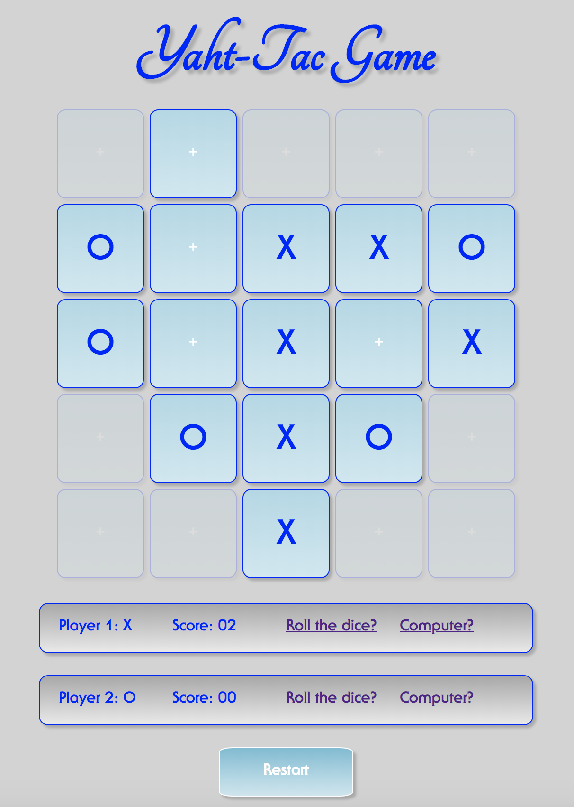

# Yaht-Tac Game

## - What is the game about?

The name of the game is **Yaht-Tac**.
*Yaht* is reminiscent of the chance game *Yahtzee*, which is a *dice game* with certain strategy in mind.
Th term *tac* is suggestive of *tactical suicide action* in the First-Person Shooter games, which (action) might result in denying the opponent (enemy) a beneficial outcome (a kill).

Starting as normal *Tic-Tac-Toe* game, **Yaht-Tac** provides gamers with ability to switch into *extended mode* with subsequent moves of the players decided upon *rolling the dice*. 

## - What features the game includes?

The game starts as a *Tic-Tac-Toe* on 3x3 board. Being a game with *complete information*, tic-tac-toe's usuall outcome is a win for a gamer making the first move, or a draw (tie), when both opponents are *perfect players*.
The win/lose situation, on the other hand, might be attributed to the difference in the gamers' skills, or, arbitrary, to a *chance*.
Major feature of **Yaht-Tac** is a possibility to avoid immenent loss of the game by transforming it into *extended mode*, 5x5 board, while additional *cells* (squares) become activated randomly upon throwing a die. 
Another feature is an option to play against computer when AI's moves are derived from *heuristics* and *miniMax* algorithms.   

## - Pain points or unsolved problems (e.g. technological, timing, content, etc.)

The pain point here is obvious: even experienced player might be distructed by mere chance.

In an effort to solve/remove this pain point, a *second chance* is given to either player by allowing to switch into *dice game* mode during the normal (3x3) part of a session.

Whether evaluating current position as unfavorable, or anticipating immenent loss, both gamers are able to invoke a *roll-of-the-dice* in an attempt to change the fortune.

### In particular:

- The *imaginable dice* has 16 faces (one through sixteen);
- Rolling the dice results in a new cell being attached to the existing board;
- The position of the new cell is matched to the face value of the dice throw;
- The roller of the dice makes the next move, but not necessarily into the
   newly attached cell;
- Second player "throews" the dice in turn, and the game proceeds in the *extended mode*;
- The new rules imply that the game's board is extended to 25 cells (5x5), which are
   added subsequently, turn by turn, in the random order;
- The winning combination in the extended game would be *four-in-the-row*;
- Gaming *heuristics algorithms*, such as *miniMax*, would be no longer applicable during *extended mode* of the game;
- Tie (draw) would be still one of the possible outcomes in the *perfect game*. A draw might become an obvious result way before all the extended cells would be deployed. Yet prediction of such situation was not implemented due to complexity of the game with incomplete information.

### Technologically, implementation presents a challenge in terms of scalability:

- Traditionally, the 3x3 board is modeled in a flat array. The current implementation is designed to go from 3x3 to 5x5 board, accepting matrix as a preferable data model. This approach has been adopted to glean complexity of the implementation with possibility of scaling further to 5x5x5 and beyond; 
- JavaScript is not yet a language with built-in *tail optimization* feature. Even simple 3x3 *Tic-Tac-Toe* board is able to hang browser due to the *maximum call stack size* being exceeded when recursive miniMax function follows the game tree with the depth higher than ten thousand calls.
To solve this challenge, the *trampolining* technique has been implemented.

## The general approach to game implementation is Object-Oriented Programming.

## The technology used is JavaScript, jQuery, HTML, CSS.

